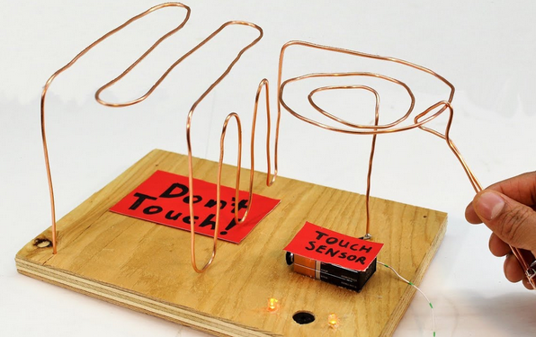

# EESTEC-Buzz-Wire-Game

Buzz wire game HW for interactive booths made for EESTEC LC Novi Sad. Made in KiCAD and order from PCB manufaturer from China.

## Example

## Idea

Idea is to make a simple custom HW board for visitors to play with and learn some basic electronics examples.

Using 555 timer chip create an oscillator which beeps a piezo buzzer when wires touch.

## Execution

TODO: add images:
 - schematic
 - PCB (KiCAD view, photos of actual PCBs)
 - board, mounting of all components